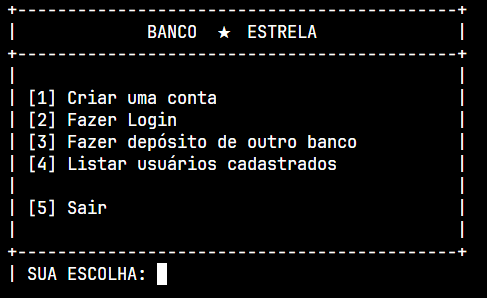
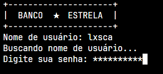
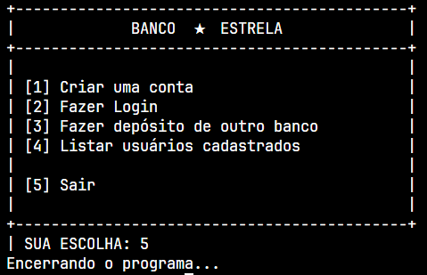
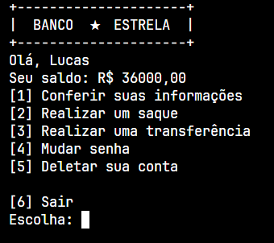
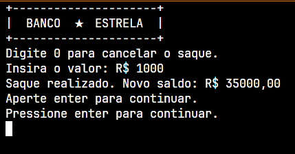
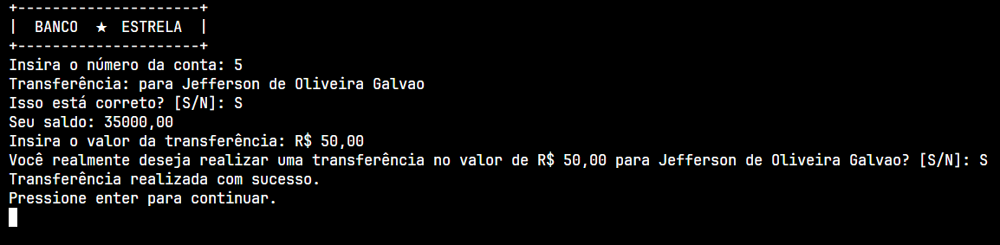

# Banco Estrela ★

Projeto não finalizado.
Início em 23/05/2024

O Banco estrela é um projeto de um banco fictício feito criado exclusivamente para fins de estudo sobre aplicação de conceito de banco de dados, operações CRUD e integração de APIs com .NET usando Entity Framework.

Durante o desenvolvimento do projeto, consegui compreender melhor o funcionamento de banco de dados, autenticação de usuários, gestão de contas e transações financeiras. A experiência proporcionou uma visão detalhada de como implementar e gerenciar um sistema bancário digital.

Por se tratar de um **projeto totalmente fictício e realizado apenas para estudos**, ***NÃO*** há qualquer tipo de segurança envolvendo os usernames e senhas.

Para os testes serem realizados sem precisar colocar um CPF válido, utilizei uma [API](https://api.invertexto.com/api-gerador-pessoas) que gera um CPF válido em um JSON, para realizar a consulta na API, utilizei uma classe `CPFGenerator.cs`, que faz uma verificação assíncrona com a API na função `GetCpfAsync()`, e uma função síncrona, `GetCpf()`, que chama a função assíncrona e retorna uma string com o CPF obtido, além disso, utilizei o pacote Newtonsoft.Json para poder transformar o retorno da API em uma string.

## Tecnologias utilizadas:

 &nbsp;  &nbsp;  &nbsp;

# Sumário:

1. [Funcionamento do código](#funcionamento-do-código)
1. [Sobre cada opção](#sobre-cada-opção)
    - [Criar uma conta](#1-criar-uma-conta)
    - [Fazer Login](#2-fazer-login)
    - [Encerrar sua conta](#3-encerrar-sua-conta)
    - [Realizar depósito de outro banco](#4-realizar-um-depósito-de-outro-banco)
    - [Sair](#5-sair)
1. [Menu pós login](#menu-pós-login)
    - [Saque](#saque)
    - [Transferência](#transferência)
1. [Tabela SQL](#tabela)


## Funcionamento do código:

Ao iniciar o programa, uma interface do banco em console é exibida pro usuário com as seguintes opções:



O menu é chamado pela função `Menu();`, além disso, também tem a função `Cabecalho();` que escreve o seguinte na tela:

```
+---------------------+
|  BANCO  ★  ESTRELA |
+---------------------+
```

## Sobre cada opção:
### [1] Criar uma conta

É basicamente o que o nome diz, ao selecionar essa opção, o console é apagado e é feito um pedido pro usuário inserir:

```
Insira seu nome:
Insira seu sobrenome:
Insira data de nascimento:
```

Ao pedir a data de nascimento pro usuário, o programa fará uma rápida verificação de idade, onde se for menor que 18 anos a criação da conta é cancelada.

```
Tudo certo! Vamos prosseguir com a criação da sua conta...

Insira seu nome de usuário:

// verificação de nome de usuário

Insira uma senha forte
    - MIN 8 CARACTERES
    - LETRA MINÚSCULA E MAIÚSCULA
    - CARACTER ESPECIAL
Insira a senha: 

// verificação de senha forte.
```

As verificações em comentários acima, consistem no seguinte: 

- Verificação de nome de usuário
    - Um loop do-while, onde caso alguém já tenha registrado aquele username, é feito um novo pedido para o usuário
- Verificação de senha forte:
    - Um loop do-while, dessa vez ele percorre a senha e verifica se ela cumpre os seguintes requisitos:
        - Mínimo de 8 caracteres
        - Pelo menos uma letra minúscula e uma maiúscula
        - Pelo menos um caracter especial

Se todos os requisitos forem cumpridos, a seguinte mensagem deverá aparecer na tela:

```
Suas redenciais cadastradas com sucesso! Seja bem-vindo(a) ao Banco Estrela!
```

E novamente o menu de opções aparece.

---

### [2] Fazer login

Ao escolher a opção dois, mais uma vez o console é limpo e é pedido pra inserir:



Caso as duas verificações sejam validas, o usuário estará logado e em seguida, outro [menu de opções](#menu-pós-login) irá aparecer.

---

### [3] Realizar um depósito de outro banco

Essa opção serve apenas para finalidade de inserir um saldo nas contas e facilitar os testes com o banco de dados. Ao selecionar, o seguinte é escrito na tela:

```
Digite o número da conta:
Digite o valor que será enviado para {Nome} {Sobrenome}: 

----------------

Confirmação:

Número da conta: {Id}
Nome completo: {Nome} {Sobrenome}

Você deseja depositar {Valor} para {Nome} {Sobrenome}? [S / N]: 

```

---

### [4] Sair



---

## Menu pós login:



### Saque:



### Transferência:



## Banco de dados:

| Id | Nome | Sobrenome | Data de Nascimento |     Username  |    Senha     |  Saldo  |
| -- | -------- | ----- | ------------------ |   ----------- | ------------ |  -----  |
| 1  | Lucas    | Rocha | 2005-09-27         |   lxsca       | SenhaF0rte!  | 35000,00 | 
| 2  | Aline    | Santiago | 0000-00-00      | aline         | S3Nha@Forte  | 4400,00 |
| 3  | Luiz Guilherme |	Bittencourt | 2005-09-06  | luizguinb | MyStr0ngPassword(!) | 3378.07    |
| 4  | Francisco |	Soares | 1991-01-17 | tiquinho_soares | B0t@fogo | 0,00 |

## Updates Futuros:

1. Adicionar CPF para criação de contas: [✔️]
    - Ao cadastrar seu CPF, o sistema fará duas verificações, a primeira é a validação do cpf, e caso seja válido, verificará se já existe no banco de dados
    - Não será possível ter duas contas com o mesmo número de CPF.
1.  Pergunta de segurança: [✔️]
    - Ao se cadastrar, o usuário terá que ter uma palavra-chave de segurança (que ainda não decidi qual será a pergunta.). Essa função é necessária para as próximas atualizações.
1. Mudar nome de usuário. [❌]
1. "Esqueci meu nome de usuário / senha":
    - Caso o usuário tenha esquecido somente a sua senha, ele precisará informar seu CPF, palavra-chave de segurança e seu nome de usuário.
    - Caso tenha esquecido seu nome de usuário, precisará informar somente seu CPF e sua palavra-chave de segurança, além disso, a opção de alterar o nome de usuário será exibida.